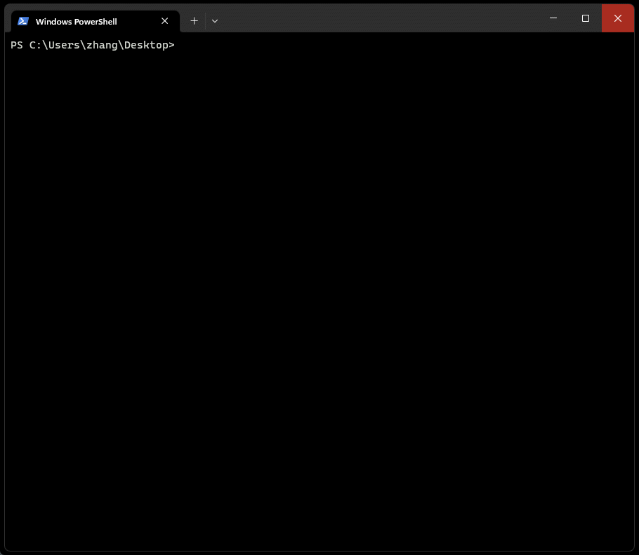

# ChatGPT-console

> chatGPT for terminal

## Usage

### 1. Configure environment variables

```
# Create .env.local file

# Your chatGPT API key
OPENAI_API_KEY="sk-4xpqTi08Jn7XX13lI1moT3XXbkXXSzLW7jXXE7oXjMXX"

# Your ChatGPT Identifier for this organization sometimes used in API requests
ORGANIZATION_ID="org-UlXXTumXqaXcEftXXPAo35XX"
```

### 2. Enter the project root directory and install dependencies

```bash
npm install
```

### 3. Start service

```bash
npm start
```

## Screenshot

<center>



</center>
